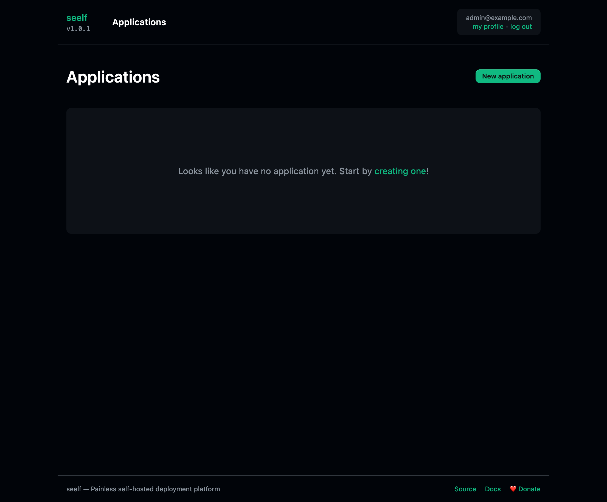
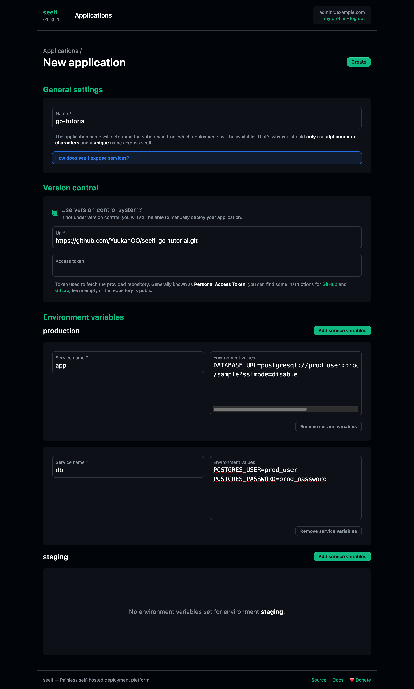
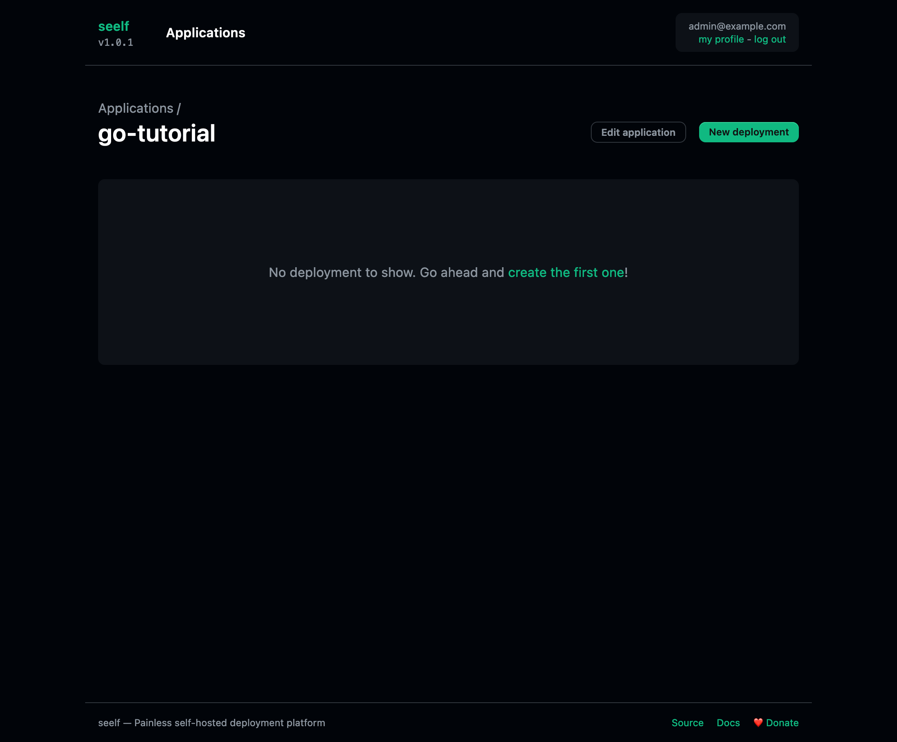
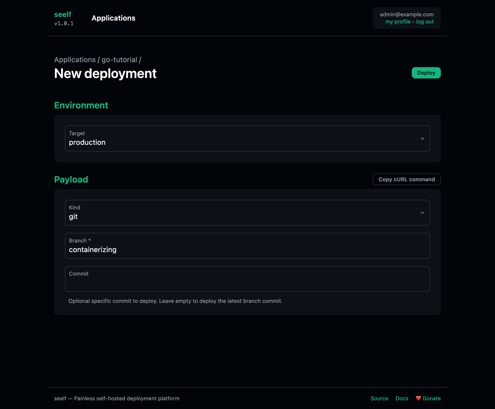
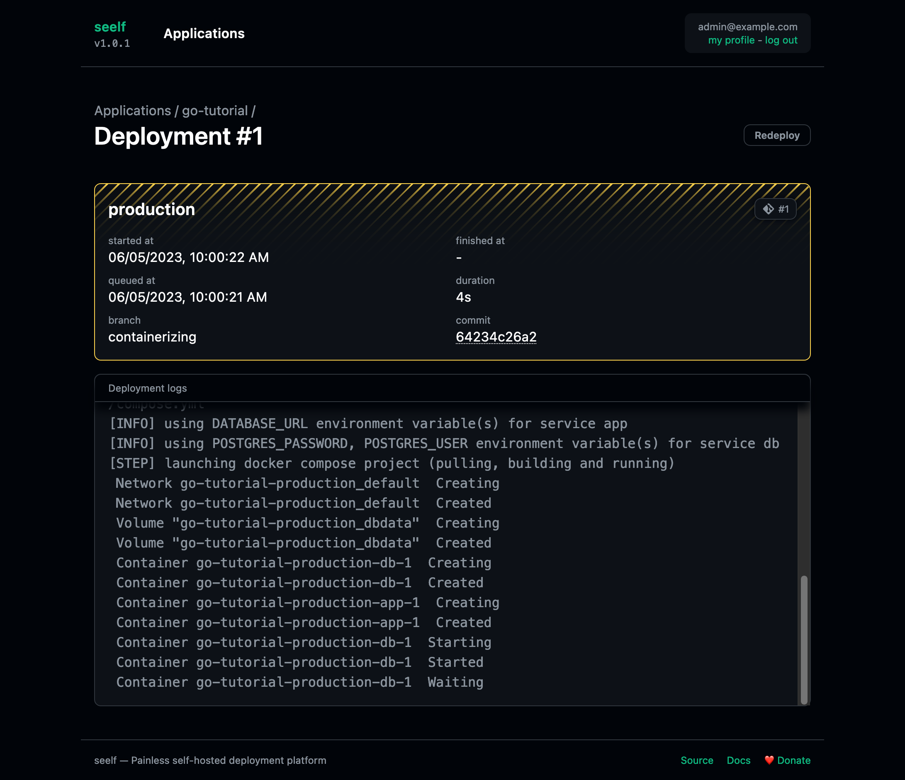
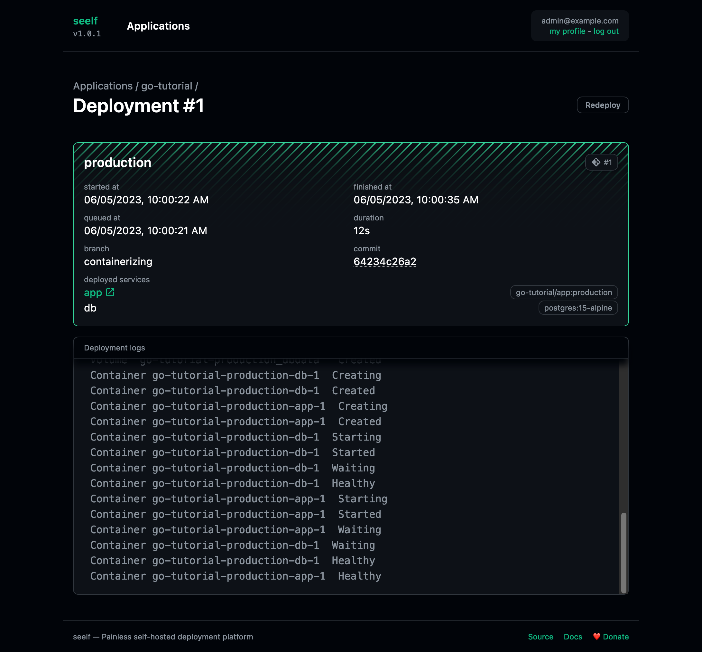
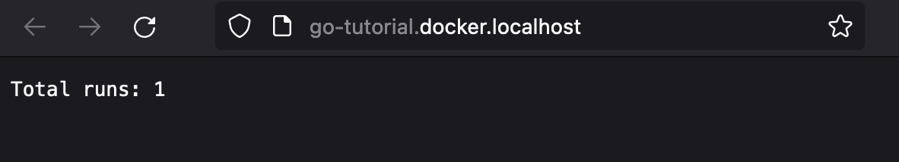

# Containerizing and deploying a Go application with seelf

This simple repository is here to demonstrate how you can easily containerize a Go application and deploy its stack using [seelf](https://github.com/YuukanOO/seelf).

The repository is divided into branches representing tutorial steps:

1. Base application ([main](https://github.com/YuukanOO/seelf-go-tutorial/tree/main))
1. Containerizing the application ([containerizing](https://github.com/YuukanOO/seelf-go-tutorial/tree/containerizing))
1. Deploying it on a seelf instance ([deploying](https://github.com/YuukanOO/seelf-go-tutorial/tree/deploying))

## Application

This is a web application which output the number of times it was started. To demonstrate how it's easy to deploy a stack on seelf, it persists its data in a PostgreSQL database.

### Building & running

```sh
docker compose up -d --build --wait
```

### Deploying on seelf

Connect on your [seelf](https://github.com/YuukanOO/seelf) instance. Check [the official documentation to deploy it](https://github.com/YuukanOO/seelf/blob/main/DOCUMENTATION.md#installation) on your own infrastructure.



Click the _New application_ button and fill the form.



To deploy this application, sets the VCS url to `https://github.com/YuukanOO/seelf-go-tutorial.git` and appropriate production environment variable for services defined in the [compose.yml](https://github.com/YuukanOO/seelf-go-tutorial/blob/containerizing/compose.yml) file.

So for the `app` service which represents our Go application, we have to set the `DATABASE_URL`, so in this example to `DATABASE_URL=postgresql://prod_user:prod_password@db:5432/sample?sslmode=disable`.

And for our database, if we want this connection string to work, we have to update the `db` service environment variables with `POSTGRES_USER` to `prod_user` and `POSTGRES_PASSWORD` to `prod_password`.

Click _Create_ and on the next screen, click on the _New deployment_ button.



Fill the branch name with `containerizing` which hold the `compose.yml` file to make our application work **locally** using Docker compose.



Click _Deploy_ and wait for our little application to go live.



After a few seconds (depending on wether you already have the images locally or if they need to be pulled), the deployment should succeed.



You can now click the _app_ link in the _deployed services_ section (if you have run seelf using the default settings locally, it should be available at http://go-tutorial.docker.localhost/) to view your service!



**Congratulations**! Your application is now live and this tutorial over!
